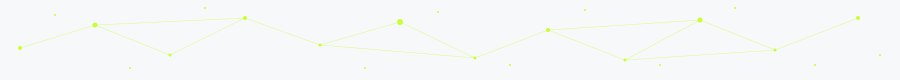

<br/>

## hi, 👋

<br/>

### About Me

```python
class JoaoVitor:
    name     = "João Vitor Guedes Fernandes"
    area     = "Studying Bioinformatics (and lovin' it)"
    location = "Rio Grande do Norte, Brazil"
    status   = "Tripping over the code, the biology, and everything in between"
```

### Stats & Current project

<table align="center" border="0" cellspacing="0" cellpadding="0">
  <tr>
    <td>
      <picture>
        <source media="(prefers-color-scheme: dark)"
          srcset="https://github-readme-stats.vercel.app/api/top-langs/?username=JVguedesF&layout=compact&langs_count=6&theme=github_dark&border_color=c9ff32&title_color=c9ff32&bg_color=1a1a1a&text_color=cccccc"/>
        
      </picture>
    </td>
    <td>
      <a href="https://github.com/JVguedesF/p53-regulatory-network">
        <picture>
          <source media="(prefers-color-scheme: dark)"
            srcset="https://github-readme-stats.vercel.app/api/pin/?username=JVguedesF&repo=p53-regulatory-network&theme=github_dark&border_color=c9ff32&title_color=c9ff32&icon_color=c9ff32&bg_color=1a1a1a&text_color=cccccc"/>
          
        </picture>
      </a>
    </td>
  </tr>
</table>

<br/>

---

<div align="center">

<picture>
  <source media="(prefers-color-scheme: dark)" srcset="https://img.shields.io/badge/Python-1a1a1a?style=for-the-badge&logo=python&logoColor=c9ff32"/>
  
</picture>
<picture>
  <source media="(prefers-color-scheme: dark)" srcset="https://img.shields.io/badge/R-1a1a1a?style=for-the-badge&logo=r&logoColor=c9ff32"/>
  
</picture>
<picture>
  <source media="(prefers-color-scheme: dark)" srcset="https://img.shields.io/badge/Bash-1a1a1a?style=for-the-badge&logo=gnubash&logoColor=c9ff32"/>
  
</picture>
<picture>
  <source media="(prefers-color-scheme: dark)" srcset="https://img.shields.io/badge/Java-1a1a1a?style=for-the-badge&logo=openjdk&logoColor=c9ff32"/>
  
</picture>
<picture>
  <source media="(prefers-color-scheme: dark)" srcset="https://img.shields.io/badge/Docker-1a1a1a?style=for-the-badge&logo=docker&logoColor=c9ff32"/>
  
</picture>

</div>

<br/>

<picture>
  <source media="(prefers-color-scheme: dark)" srcset="./footer-dark.svg"/>
  
</picture>
